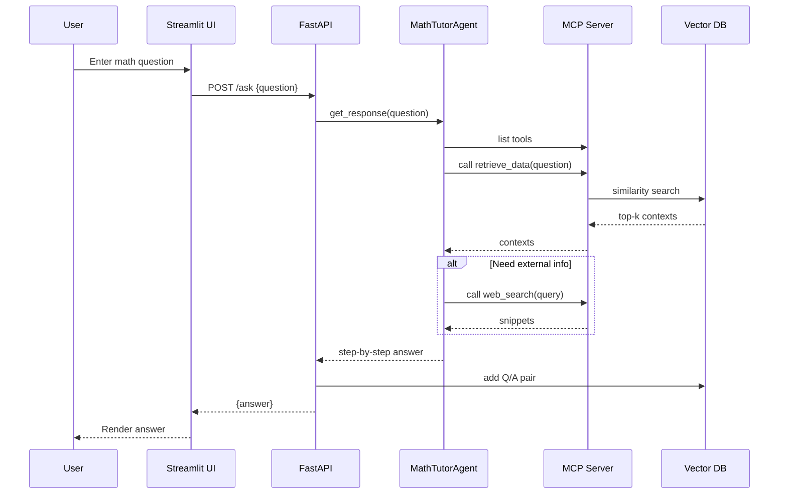
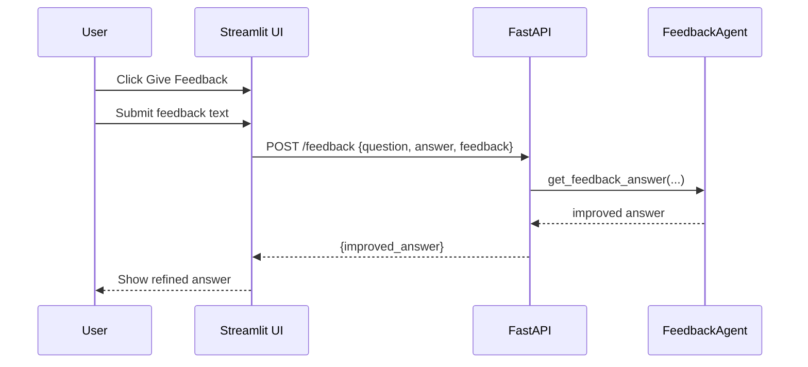

# Architecture

## System Overview
```mermaid
flowchart LR
    U[User Browser\n(Streamlit)] -->|Question / Feedback| FE[Frontend\napp.py]
    FE -->|HTTP /ask| API[FastAPI Server\napi_server.py]
    FE -->|HTTP /feedback| API
    API -->|Invoke| AG[MathTutorAgent\nagent.py]
    AG -->|Tool Call| MCP[MCP Server\nmcp_server.py]
    MCP -->|retrieve_data| VDB[(Vector DB\nFAISS Index)]
    MCP -->|web_search| WEB[(External Search)]
    AG -->|Answer| API
    API -->|Store Q/A| VDB
    API -->|Answer JSON| FE
    FE -->|Improved Answer Request| API
    API -->|Refinement| FB[FeedbackAgent]
    FB -->|Improved Answer| API --> FE
```

## Data Flow (Step-by-Step)
1. User submits a math question.
2. Frontend sends POST /ask to API.
3. API calls `MathTutorAgent.get_response()`.
4. Agent requests tool list and triggers `retrieve_data` (and optionally `web_search`).
5. Agent composes a step-by-step solution.
6. API returns the answer and persists (Q,A) into FAISS.
7. User clicks "Give Feedback" and submits refinement text.
8. Frontend calls POST /feedback.
9. API invokes `feedbackAgent` to produce an improved answer.
10. Improved answer is returned to UI (original Q/A already stored; optionally could store refined answer variant if enabled).

## Sequence Diagram (Simplified Ask Flow)


## Sequence Diagram (Feedback Flow)


## Components
| Component | Responsibility |
|-----------|----------------|
| Streamlit Frontend | Chat interaction, feedback collection, rendering answers. |
| FastAPI API | Orchestrates agent calls, exposes endpoints, stores Q/A. |
| MathTutorAgent | Math-only gating, tool-first reasoning, solution generation. |
| FeedbackAgent | Single-pass refinement using user feedback. |
| MCP Server | Hosts retrieval + web search tools. |
| Vector DB (FAISS) | Persistent semantic memory of solved Q/A pairs. |

## Extensibility Ideas
- Add a VerificationAgent (symbolic equivalence via SymPy) before storing answers.
- Maintain per-user namespaces in FAISS.
- Add latency + token usage metrics endpoint.
- Swap embedding model for higher dimensional transformer if recall degrades.

## Notes
- Diagram generation uses Mermaid; GitHub renders this automatically.
- If Mermaid is not rendered (some viewers), copy code blocks into an online Mermaid renderer.
